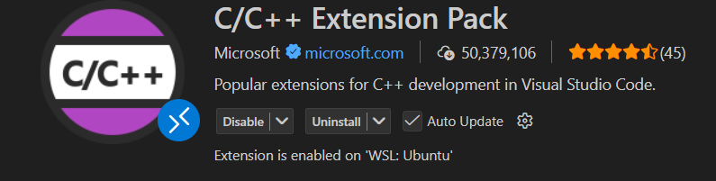
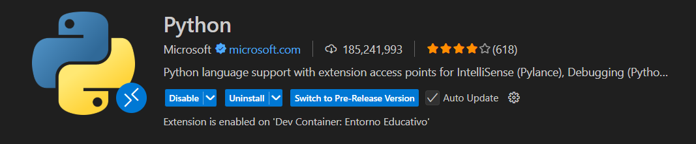

# Bienvenid@s a **uprsj-jlopez**

Este repositorio contiene la guía inicial para configurar tu entorno de desarrollo y comenzar a trabajar con la organización **uprsj-jlopez**.

---

## 📌 Requisitos previos

Antes de comenzar, **debes tener una cuenta de GitHub activa**.

---

## 🛠️ Configuración del Entorno de Desarrollo

Sigue los pasos a continuación para instalar y configurar las herramientas necesarias:

### 1. Instalar **Visual Studio Code**

Descarga e instala Visual Studio Code desde el sitio oficial:

👉 [https://code.visualstudio.com/](https://code.visualstudio.com/)

---

### 2. Instalar **Windows Subsystem for Linux (WSL)**

Para poder usar herramientas de desarrollo basadas en Linux, instala WSL siguiendo la guía de Microsoft:

👉 [https://learn.microsoft.com/windows/wsl/install](https://learn.microsoft.com/windows/wsl/install)

> Recomendación: elige **Ubuntu** como tu distribución de Linux en WSL.

Una vez instalado WSL, abre la terminal de **Ubuntu** desde el menú Inicio.

---

### 3.5 Conectar VSCode a WSL por primera vez

Antes de aceptar la invitación a la organización, es **muy importante** abrir VSCode conectado a WSL.

1. Abre la terminal de **Ubuntu (WSL)**.
2. Ejecuta el siguiente comando:

```bash
code .
```

3. VSCode se abrirá mostrando en la esquina inferior izquierda:
   **"WSL: Ubuntu"**.

Esto asegura que:

* VSCode usará el entorno Linux de WSL.
* Los repositorios se clonen y trabajen dentro de WSL.
* Al aceptar la invitación y abrir repositorios desde GitHub, el IDE ya esté correctamente conectado.

> ⚠️ Si el comando `code` no existe todavía, instala primero la extensión **WSL** en VSCode y reinicia VSCode.

---

### 3. Instalar dependencias básicas en WSL

Dentro de la terminal de Ubuntu (WSL), ejecuta los siguientes comandos:

```bash
sudo apt update
sudo apt install -y build-essential python-is-python3
```

Esto instalará:

* **build-essential** → Compilador GCC, `make` y librerías estándar para C/C++.
* **python-is-python3** → Hace que el comando `python` apunte a Python 3.

Verifica la instalación con:

```bash
gcc --version
python --version
```

---

### 4. Instalar Extensiones en VSCode

Abre **Visual Studio Code** y desde el panel de extensiones instala las siguientes:

* **Git Graph** – Visualiza el historial y ramas de tu repositorio de forma gráfica.

  
  
* **WSL** – Integra VSCode con el subsistema WSL.

  

* **C/C++ Extension Pack** – Conjunto de extensiones para desarrollo en C y C++.

  
  
* **Python Extension Pack** – Conjunto de extensiones para desarrollo en Python.

  

Para instalar extensiones:

1. Presiona `Ctrl + Shift + X` para abrir el panel de extensiones.
2. Busca cada nombre.
3. Haz clic en **Install**.

---

### 5. Aceptar Invitación a la Organización

Hemos enviado una invitación para unirte a la organización **uprsj-jlopez** en GitHub.

✅ **IMPORTANTE:** Acepta la invitación siguiendo esta guía en video:

📺 [](https://youtu.be/Znbt9d9jszo)

---

## 🚀 ¡Listo para Empezar!

Una vez completados los pasos anteriores:

✔️ Tu entorno de desarrollo estará preparado

✔️ Podrás clonar nuestros repositorios

✔️ Podrás trabajar con código en C, C++ y Python

---

## 📬 Soporte

Si tienes dudas o problemas durante la instalación:

* Abre un *issue* en el repositorio correspondiente.
* Contacta con tu instructor.

---

**Autor: Jesus Salvador Lopez Ortega (Profesor IRC/ISW/ITIID)** [LinkedIn](https://www.linkedin.com/in/jesus-salvador-lopez-ortega/) | [GitHub](https://github.com/chucholoport) | [Correo Institucional](mailto:jlopez@upsrj.edu.mx) 
